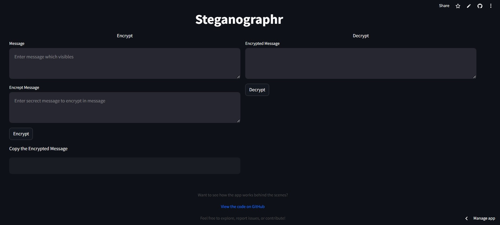

# Steganographr

## Live Demo
Try the app directly on the Streamlit Gallery:  
[](https://hideandseek.streamlit.app/)




This Steganographr is a Python-based steganography tool that uses zero-width characters to hide secret messages within visible text. The tool is implemented using Streamlit for a simple and interactive web-based interface.

## Features

- **Encrypt Messages**: Hide a secret message within a visible text message using zero-width characters.
- **Decrypt Messages**: Extract the hidden secret message from an encrypted message.

## Installation

1. Clone the repository:
   ```bash
   git clone https://github.com/yourusername/steganographr.git
   cd steganographr
   ```

2. Install dependencies:
   ```bash
   pip install -r requirements.txt
   ```

## Usage

1. Run the Streamlit app:
   ```bash
   streamlit run app.py
   ```

2. Open the app in your browser at `http://localhost:8501`.

3. Use the interface to encrypt or decrypt messages.

## Code Overview

### Functions

#### `strToBin(text: str) -> List[str]`
Converts a string into a list of binary representations for each character.

#### `binToHide(data: List[str]) -> str`
Converts binary data into a zero-width character representation.

#### `wrap(text: str, hideText: str) -> str`
Wraps the hidden text (encoded in zero-width characters) into the visible text.

#### `unwrap(text: str) -> str`
Extracts the hidden zero-width text from the visible text.

#### `hideToBin(text: str) -> List[str]`
Converts zero-width character representation back into binary data.

#### `binToStr(data: List[str]) -> str`
Converts binary data back into the original string.

### Streamlit Interface

The app provides two main functionalities:

- **Encrypt**: Enter a visible message and a secret message. The app will generate an encrypted message.
- **Decrypt**: Enter an encrypted message. The app will extract and display the hidden secret message.

## File Structure

```plaintext
.
├── app.py             # Main Streamlit app
├── steganography.py   # Core steganography functions
├── requirements.txt   # Python dependencies
└── README.md          # Project documentation
```

## Dependencies
- Python 3.8+
- Streamlit

## Contributing
Contributions are welcome! Feel free to submit issues or pull requests to improve this project.

## License
This project is licensed under the MIT License. See the LICENSE file for details.

## Acknowledgments
Thanks to the developers and the open-source community for their invaluable tools and resources.  
Special thanks to [Neatnik's Steganographr](https://github.com/neatnik/steganographr) for providing guidance.
